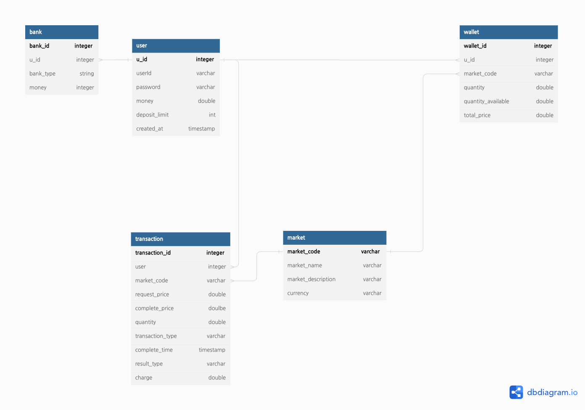

# Kubit-Spring

`KUBIT` backend server with `Spring Boot` 

# Schema

# API

## Login

- url

  `{root}/api/v1/login/`

- method

  `POST`

- request body

  | Key      | Type(?) | Description    |
  | -------- | ------- | -------------- |
  | userId   | String  | 사용자 계정 ID |
  | password | String  | 사용자 계정 PW |

- response

  | Key            | Type(?) | Description                                        |
  | -------------- | ------- | -------------------------------------------------- |
  | result_code    | int     | 200 : 400 : 500 :                        |
  | result_message | String  | 응답 관련 메시지 200 :  400 : 500 : |
  | access_token   | String? | jwt access token                                   |
  | refresh_token  | String? | jwt refresh token                                  |
  | investment     | Object? | { krw: 10000, wallet_list : [ ] }   |
  |                |         |                                                    |